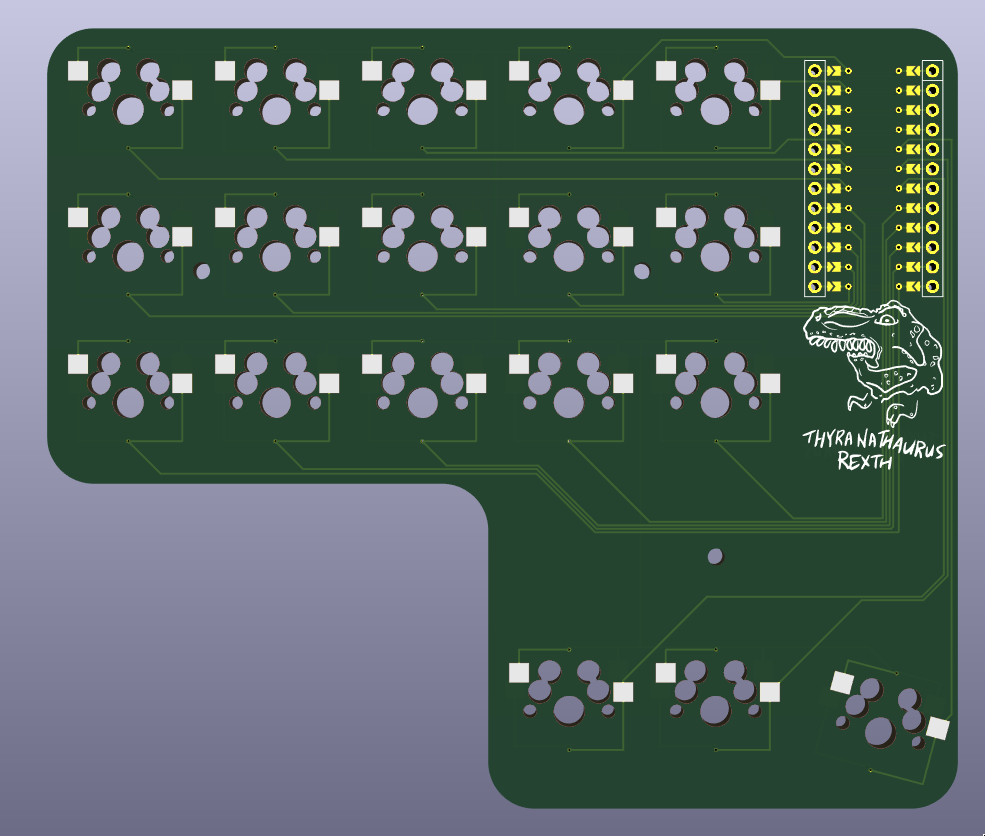

  

# Thyranathaurus Rexth

Several versions of a split keyboard I created using [Ergogen](https://github.com/ergogen/ergogen).

## [T-Rexth 36 Wired](./t-rexth-36-wired)

- 36 keys
- Split keyboard
- Ortholinear
- Wired
- MX switch compatible
- Hot swap sockets

## [T-Rexth 36](./t-rexth-36)

- 36 keys
- Split keyboard
- Ortholinear w/columnar stagger
- Wireless
- MX switch compatible
- Hot swap sockets
- Tenting puck compatible

## [T-Rexth 30](./t-rexth-30)

- 30 keys
- Split keyboard
- Ortholinear w/columnar stagger
- Wireless
- Choc switch compatible
- Minimal spacing
- Tenting puck compatible

# Credits/Thanks

- Created with [Ergogen](https://github.com/ergogen/ergogen) by [MrZealot](https://zealot.hu/)
- Motivated by [Ben Vallack's videos](https://www.youtube.com/channel/UC4NNPgQ9sOkBjw6GlkgCylg)
- [Guide](https://flatfootfox.com/ergogen-introduction/) by [FlatFootFox](https://flatfootfox.com/)
- Lots of help from members of [Ergogen Discord](https://discord.gg/nbKcAZB)
- Artwork by [Perce](https://madebyperce.com)
- Keycaps by [Pseudoku](https://github.com/pseudoku/PseudoMakeMeKeyCapProfiles)
- Tenting Puck by [lacohe](https://www.thingiverse.com/thing:5336898)
