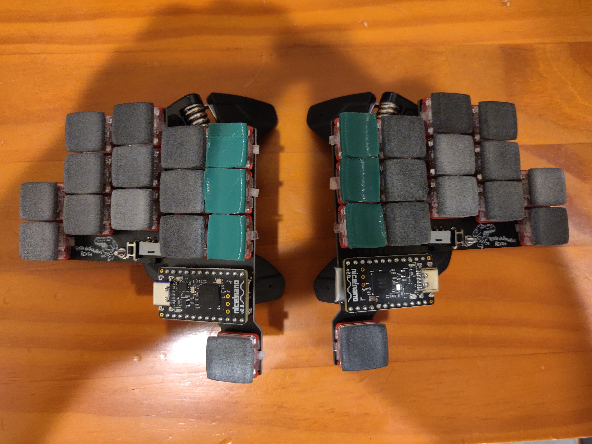

# Thyranathaurus Rexth 30

## Notes

This was my first attempt at building a custom keyboard, and has a couple issues:

- Attempting to solder battery wires onto the PCB without shorting your battery can be tricky.
- The spacing between the innermost columns is not wide enough, thus the philadelphia minimalist keycaps [do not fit both columns](./images/choc30_single.jpg).
